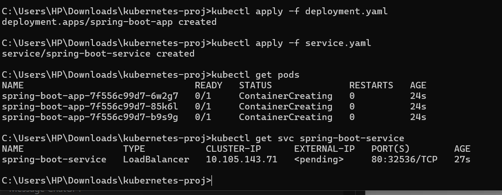
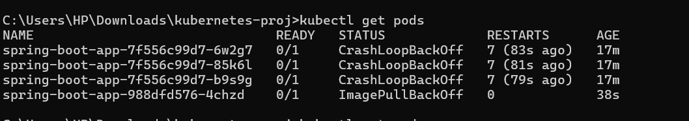

# Spring Boot Application Deployment on Kubernetes

## Step 1: Build the Docker Image for Your Spring Boot Application

1. Ensure you have your Spring Boot application ready and the JAR file is located under `target/myapp.jar`.
2. Create a `Dockerfile` in the root directory of your project (see Dockerfile section).
3. Build the Docker image:
    ```bash
    docker build -t yourusername/my-spring-boot-app .
    ```

## Step 2: Push the Docker Image to Docker Hub

1. Log in to Docker Hub:
    ```bash
    docker login
    ```
2. Push your Docker image:
    ```bash
    docker push yourusername/my-spring-boot-app
    ```

## Step 3: Deploy on Kubernetes

1. Create a `deployment-v1.yaml` file (see Deployment v1 section).
2. Apply the deployment YAML:
    ```bash
    kubectl apply -f deployment-v1.yaml
    ```

3. Create a `service.yaml` file to expose the app (see Service section).
4. Apply the service YAML:
    ```bash
    kubectl apply -f service.yaml
    ```

## Step 4: Verify the Deployment

1. Check the status of your pods:
    ```bash
    kubectl get pods
    ```
2. Check the service to get the external IP:
    ```bash
    kubectl get svc spring-boot-service
    ```

## Step 5: Simulate Traffic Spike

Once your app is exposed, use `curl` to simulate traffic. Replace `<external-ip>` with the external IP from the `kubectl get svc` output:

```bash
curl http://<external-ip>:80
```


1. **Build and push your Docker image** using the `Dockerfile` provided.
2. **Deploy the Spring Boot application** to Kubernetes using the `deployment-v1.yaml` and `service.yaml`.
3. **Simulate traffic spikes** using `curl`.
4. **Perform a rolling update** by modifying the `deployment-v2.yaml`.



